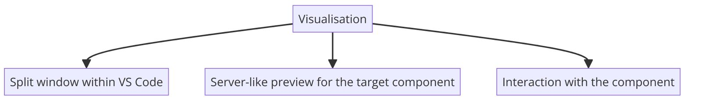
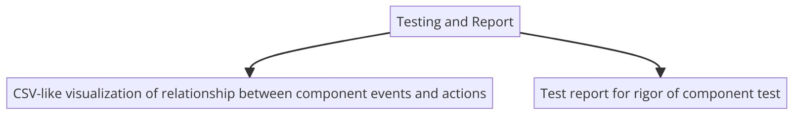

# RenderTest: Streamline Your UI Testing with Automated Component Rendering

An automated **Frontend Component Tester** designed to improve development speed by automating rendering, previews, and test case generation for React components. RenderTest eliminates manual efforts, ensuring higher code quality and enabling seamless collaboration between developers and designers.

---

# 👥 Team Members

- Nishant Holla - PES1UG23CS401 [Github](https://github.com/nishantHolla)
- Pranav Hemanth - PES1UG23CS433 [GitHub](https://github.com/Pranavh-2004)
- Kshitij Koushik Kota - PES1UG23CS908 [GitHub](https://github.com/kshitijkota)
- Sampriti Saha - PES1UG23CS505 [GitHub](https://github.com/Sampriti2803)

---

# 📋 Project Description

RenderTest automates the rendering, previewing, and testing of React components to reduce manual testing effort and ensure real-time updates. It provides a live dashboard where developers can visualize component states and interactions. By automating test case generation for events like clicks, form validation, and modals, RenderTest ensures all UI components are tested efficiently, minimizing bugs and regressions.

---

## 📊 Flowchart




---

# 🎯 Target Audience

- **Frontend Developers**: Automate previews and testing to focus more on feature development.
- **QA Engineers**: Auto-generate test cases for quick testing and full coverage.
- **Designers & UI/UX Teams**: Use live previews to interact with components and provide feedback in real-time.
- **Agile Teams**: Sync UI changes with tests and automate CI/CD workflows for fast releases.
- **Organizations with Large Component Libraries**: Manage large libraries with real-time rendering and automated regression detection.

---

# ⚙️ Solution Features

1. **Automated Component Rendering**

   - Dynamically renders React components with various props and states.
   - Integrated live preview dashboard to visualize components without running the full application.

2. **Smart Test Case Generation**

   - Automatically generates and updates test cases for events (e.g., clicks, form fields).
   - Ensures that tests remain aligned with UI changes by continuously monitoring components.

3. **Seamless Framework Integration**

   - Built-in support for React with flexibility to extend across frameworks.
   - Direct interaction with component props and states for reliable testing.

4. **CI/CD Integration**
   - Compatible with DevOps workflows, ensuring smooth integration into pipelines.

---

# 🛠️ Tech Stack

### **Frontend:**

- **React**: For UI visualization and previews.
- **CSS**: Styling the test bench and components.
- **Webview API**: Supports custom HTML rendering inside IDEs (e.g., VS Code).

### **Backend:**

- **Node.js**: Handles interactions between the frontend and local environment.
- **Express.js**: Exposes APIs for testing and rendering processes.
- **Webpack**: Dynamically compiles React components.

---

## 🔄 Setup

1. **Generate a new SSH key** and add it to GitHub.  
   [Follow this video](https://www.youtube.com/watch?v=O5H_KFzla6M).

2. **Clone the repository**:
   ```bash
   git clone https://github.com/Pranavh-2004/R3ND3R_Test.git
   cd R3ND3R_Test
   ```
3. **Create a new branch with your name and switch to it**:
   ```bash
   git branch "your_name"
   git switch "your_name"
   ```
4. **Push changes to your branch**:
   ```bash
   git config --global user.email "your-email@example.com"
   git config --global user.name "your-username"
   git add README.md
   git commit -m "Updated README"
   git push origin "your_name"
   ```
5. **Install dependencies**:
   ```bash
   npm install
   ```

## 💡 Future Enhancements

- **Enhanced Framework Support**: Extend beyond React to support other frontend frameworks.
- **Real-Time Alerting**: Notify developers of UI issues with email/SMS alerts.
- **Adaptive Testing**: Integrate reinforcement learning for smarter test case generation.
- **Component Analytics**: Track component usage and performance metrics.

## 📜 License

This project is licensed under the MIT License - see the LICENSE file for details.

## Extension Settings

Include if your extension adds any VS Code settings through the `contributes.configuration` extension point.

For example:

This extension contributes the following settings:

- `myExtension.enable`: Enable/disable this extension.
- `myExtension.thing`: Set to `blah` to do something.

## Known Issues

Calling out known issues can help limit users opening duplicate issues against your extension.

## Release Notes

Users appreciate release notes as you update your extension.

### 1.0.0

Initial release of ...
